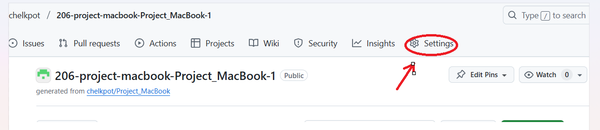
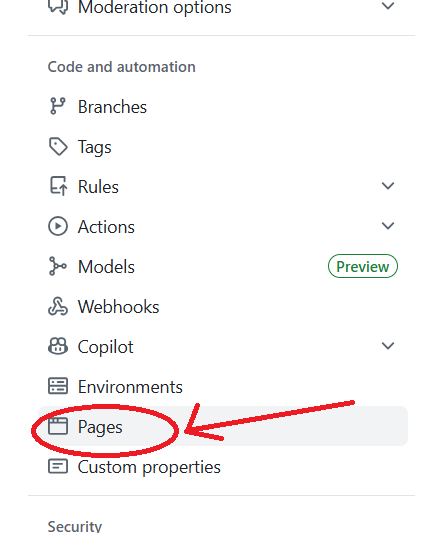
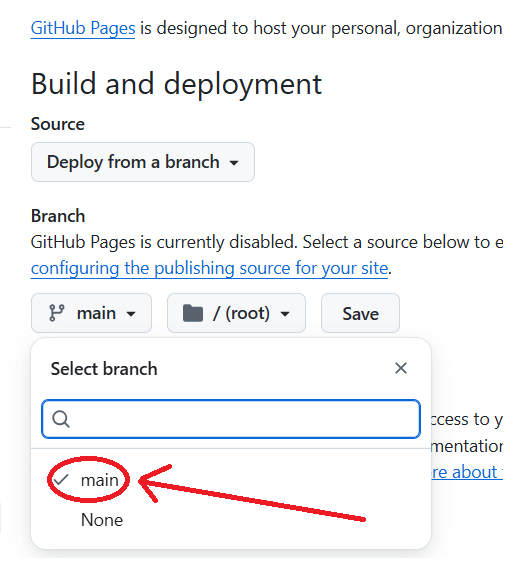
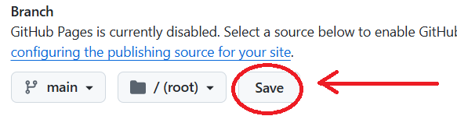
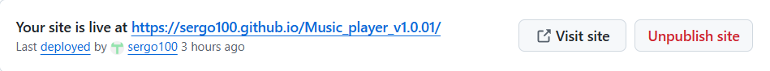

# Задание: Вам необзодимо сдельть верстку страницы используя НTML и CSS

## Внимание  все репозитариии  приватные
Для клонирования в случае остуствия доступа используйте команду:
**git clone https://ваш токен@ссылка на ваш репозиторий**


<a href="https://www.figma.com/design/XJ7kPCKl4lYNVqhx4soIj5/simple-and-professional-website-landing-page-design--Community-?node-id=1-3&t=o6tn3ndxNuf9PZ50-0">**Ссылка на проект Figma**</a>

## Внимание
Для того чтобы Github загрузил ваш репозитарий как HTML нужно в настройках включить загрузку страницы pages

 

После того как выбрали Pages нужно выбрать загрузку с ветки main

 

Для сохранения нажмите на кнопку save. Подождите 3 минуты и появится url адрес вашей страницы



## Цель
Научиться создавать веб-страницы с помощью CSS и HTML,

## Описание
Используя готовый файл **index.html**, подключите к нему внешний файл **style.css** и выполните следующие задачи:

1. Создайте файл index.html
2. Создайте файл style.css и подключите его к index.html
3. После выполнения добавьте ваши файлы в индекс репозитария и сделайте комит
4. Не забудьте сделать git push origin main
ccm
## Файлы
- **index.html** — HTML-структура страницы.  
- **style.css** — стили оформления текста.
- **/images** - папка со всеми необходимыми изображениями

## Требования к выполнению
- Все стили должны быть описаны только во внешнем CSS-файле.  
- В HTML не допускается использование встроенных или инлайновых стилей.  
- Стили должны корректно применяться к соответствующим элементам.  


💡 *Подробные примеры и объяснения приведены в презентации, прикреплённой к заданию.*

## Не забудь команды для git:
```
git clone -клонировать репозитарий
git status - проверить состояние файлов перед индексом и коммитом
git add <имя файла> - добавить файл в индекс
git commit -m"собщение" - добавить файлы и собщение в репозитарий
git push origin main- "запушить" отправить репозитарий на удаленный сервер (Github)
```
